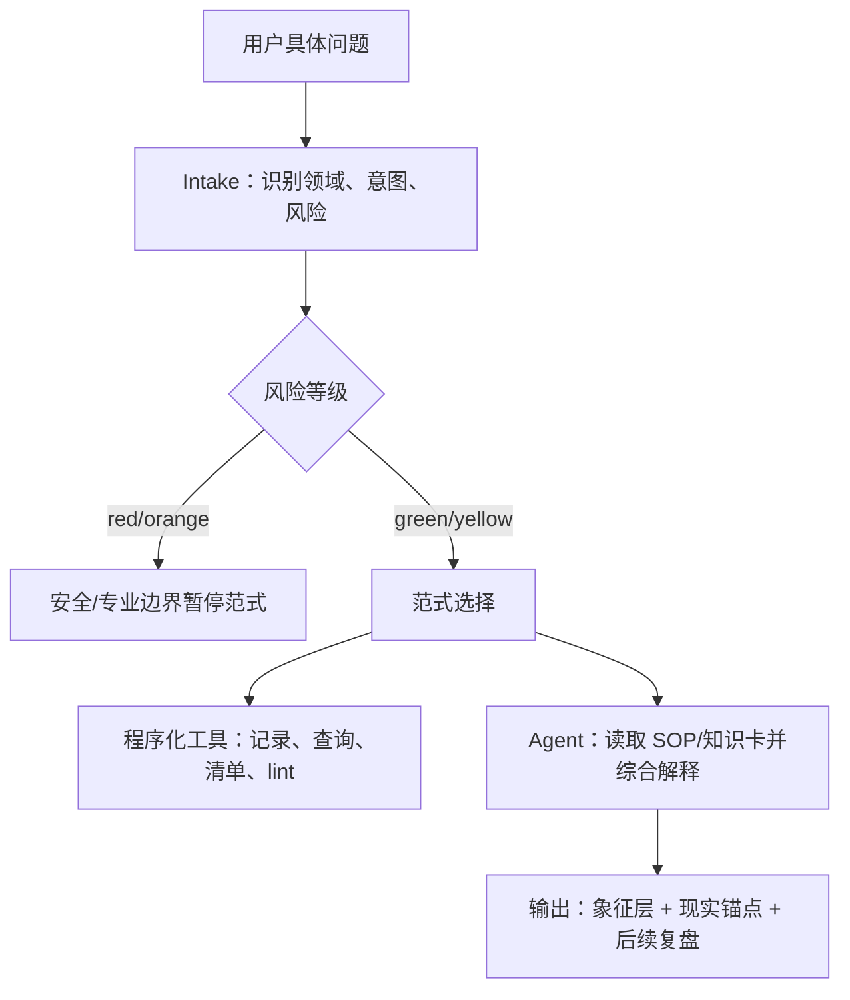

# 问题到范式映射

本页定义“从具体问题推导适用范式”的规则。它补在路由和流派 SOP 之间：路由回答“属于哪个领域”，范式回答“应该用什么处理框架”。

## 总流程



## 范式清单

| 范式 | 适用问题 | 自动化部分 | 需要 Agent 的部分 |
| --- | --- | --- | --- |
| 安全/专业边界暂停 | 医疗、法律、财务、精神危机、危险仪式、伤害风险 | intake、risk route、pause reason | 解释边界，给现实支持或低风险替代 |
| 来源语境与勘误 | “这个流派是什么”“来源是什么”“哪个说法对” | 路由、资料入口、来源字段提示 | 比较派别，标注不确定性，避免伪权威 |
| 现实观察与低风险行动 | 风水、空间、失物、声响、芳香、颜色、命名等 | 观察记录、清单、排序、候选比较 | 结合场景生成可执行建议和复盘点 |
| 身体/睡眠体验记录 | 解梦、鬼压床、身体征兆、能量感受 | 红旗筛查、体验记录、普通诱因提示 | 把体验转成象征反思和现实照料 |
| 媒介记录与象征反思 | 牌、签、骰、符物、茶渣、蜡泪、香灰、书占 | 媒介记录、符号查询、未知来源提示 | 选择解释层级，连接现实问题 |
| 问题澄清与决策镜像 | 塔罗、易经、占星、命理、择日等决策/局势问题 | 问题拆分、输入字段、盘面/牌阵记录 | 避免确定预测，给行动选项和复盘 |
| 民俗语境与安全回应 | 民俗禁忌、生肖、太岁、月相、水逆、征兆 | 地区/来源记录、非恐吓改写 | 解释文化语境和现实回应 |
| 低风险象征反思 | 其他可安全处理的象征请求 | 路由、基础记录、output lint | 生成非决定论、可停止的反思输出 |

## 示例

| 用户问题 | 推荐范式 | 处理要点 |
| --- | --- | --- |
| “帮我做一个塔罗三张牌，看看工作状态” | 问题澄清与决策镜像 | 记录问题、牌阵、牌面；输出工作状态反思和一周行动 |
| “用塔罗看看我明天要不要贷款梭哈股票” | 安全/专业边界暂停 | 财务风险暂停，不做占卜建议 |
| “卧室床对门，最近睡不好，风水上怎么调整” | 现实观察与低风险行动 | 先看动线、睡眠、光线、噪音、安全；再给低成本调整 |
| “昨晚鬼压床还看到黑影，是不是有东西” | 身体/睡眠体验记录 | 不确认灵体；记录睡眠和红旗；给醒后安定流程 |
| “这个签文是上签，能不能说明一定复合” | 媒介记录与象征反思 | 记录签文来源；拒绝确定复合；转成沟通和边界反思 |
| “中元节晚上不能出门是真的吗” | 民俗语境与安全回应 | 标注地区民俗；不恐吓；给现实安全建议 |
| “人类图是谁发明的，和占星有什么关系” | 来源语境与勘误 | 做现代来源、体系拼接和争议边界 |

## 程序化接口

```bash
python3 agent-tools/scripts/paradigm_selector.py --text "帮我做一个塔罗三张牌，看看工作状态"
```

该工具输出：

- 所属主干。
- 问题类型。
- 推荐范式。
- 自动化/Agent/人工审校边界。
- 科学化、溯源勘误、神秘边界和案例验证标记。

